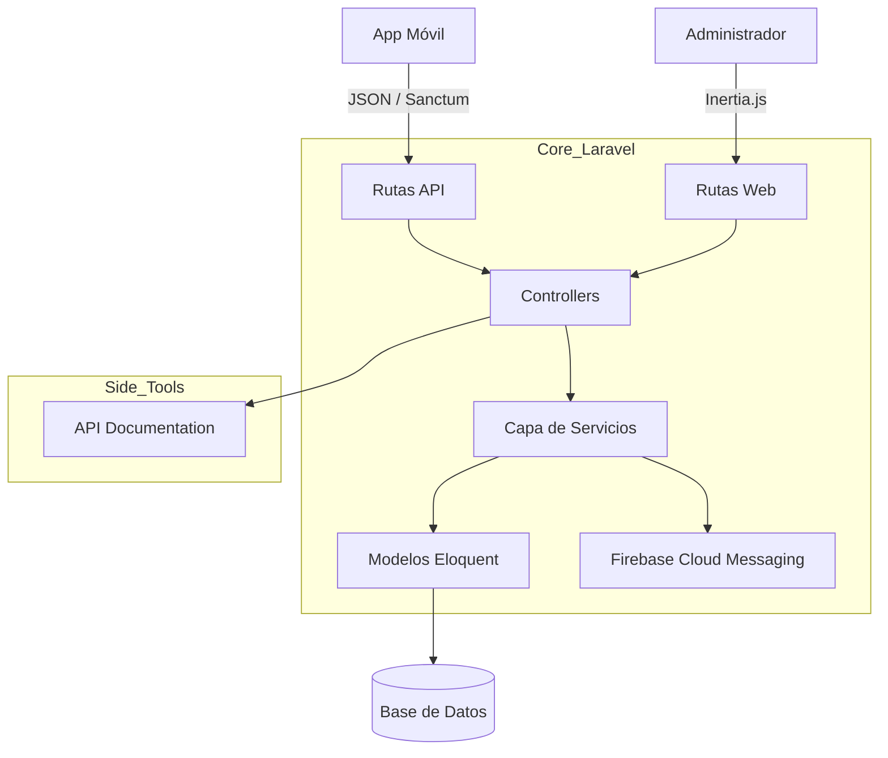

# 🏗️ Informe de arquitectura: api.biblia-pdv

## 🛠️ Pila tecnológica
*(Basado en el análisis de composer.json y package.json)*
- **Lenguaje/Tiempo de ejecución:** PHP 8.2+
- **Marco principal:** Laravel 12.0
- **Dependencias clave:**
  - `inertiajs/inertia-laravel`: Integración para el panel administrativo.
  - `laravel/sanctum`: Autenticación para la API móvil.
  - `kreait/laravel-firebase`: Gestión de notificaciones push.
  - `spatie/laravel-permission`: Control de roles y permisos.
  - `vue 3`: Framework para el frontend (Inertia).
  - `editorjs/editorjs`: Editor de contenido enriquecido.
- **Herramientas de compilación/análisis:** Vite, Pest, Scribe (Documentación de API), Laravel Pint (Linter).

## 📂 Estructura del proyecto
```texto
/
├── app/
│   ├── Http/
│   │   ├── Controllers/    # Controladores de API e Inertia
│   │   ├── Requests/       # Validaciones de entrada (FormRequests)
│   │   └── Resources/      # Transformación de datos (API Resources)
│   ├── Models/             # Modelos Eloquent
│   ├── Services/           # Lógica de negocio desacoplada de controladores
│   └── Providers/          # Proveedores de servicios del framework
├── config/                 # Configuración global de la aplicación
├── database/               # Migraciones, factories y seeders
├── resources/
│   ├── js/                 # Componentes Vue 3 y páginas de Inertia
│   └── views/              # Plantillas Blade (principalmente root para Inertia)
├── routes/
│   ├── api.php             # Endpoints para la App Móvil
│   └── web.php             # Rutas para el Panel Administrativo (Inertia)
├── tests/                  # Pruebas automatizadas (Unitarias y de Feature)
├── public/                 # Punto de entrada y assets estáticos
└── composer.json           # Dependencias y scripts PHP
```

## 🏛️ Análisis arquitectónico
**Patrón detectado:** Arquitectura por Capas con Services Pattern.
**Descripción:** El proyecto utiliza una estructura robusta donde los **Controllers** delegan la lógica de negocio a la capa de **Services**. La comunicación con la App Móvil se gestiona mediante tokens de **Sanctum** y respuestas JSON estandarizadas por **API Resources**. El panel administrativo utiliza **Inertia.js**, eliminando la necesidad de una API dedicada para la gestión interna al permitir que Vue 3 funcione como el motor de vistas de Laravel.

## 📊 Diagrama arquitectónico (Mermaid)


## 📝 Observaciones técnicas
1. **Punto fuerte:** El uso de `Services` permite que la lógica sea compartida fácilmente entre los controladores de la API y los del panel administrativo (Inertia), garantizando el principio DRY.
2. **Punto destacado:** La integración de `Scribe` asegura que la documentación de la API esté siempre sincronizada con el código mediante anotaciones en los controladores.
3. **Seguridad:** Implementación de políticas de acceso (`Policies`) y permisos granulares con Spatie, asegurando que solo usuarios autorizados gestionen el contenido.
