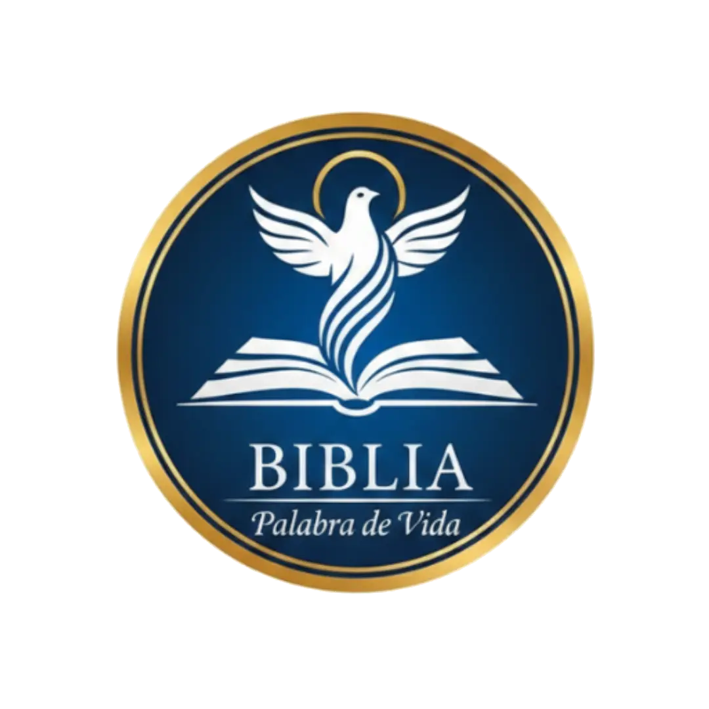

# 📖 Biblia Palabra de Vida

<p align="center">
  
</p>

## 🌟 Resumen del Proyecto

**Biblia Palabra de Vida** es una plataforma web moderna y minimalista diseñada para la lectura de la Biblia y el estudio espiritual. Construida con **Laravel 12**, **Vue 3** e **Inertia.js**, ofrece una experiencia de usuario premium, rápida y totalmente optimizada para dispositivos móviles y buscadores (SEO).

### Características Principales:

-   **Lectura Fluida**: Navegación rápida entre libros y capítulos de la Biblia.
-   **Devocional Diario**: Reflexiones diarias actualizadas para el crecimiento espiritual.
-   **Optimización SEO**: Implementación de **Server-Side Rendering (SSR)** y **Sitemaps Dinámicos** para máxima visibilidad en Google.
-   **Modo Oscuro/Claro**: Interfaz adaptable con estética premium (Glassmorphism).
-   **Multi-dispositivo**: Sincronización de favoritos y notas personales (en desarrollo).

---

## 🚀 Requisitos para Despliegue

Para garantizar el correcto funcionamiento del proyecto, especialmente del motor de renderizado SSR y las funciones de búsqueda, el servidor debe cumplir con:

-   **PHP**: ^8.2
-   **Node.js**: ^22.0 (Requerido para el soporte total de SSR y Vite 7)
-   **Base de Datos**: SQLite (para las versiones de la Biblia) y MySQL/PostgreSQL para la gestión de usuarios.
-   **Extensiones PHP**: `pdo_sqlite`, `mbstring`, `openssl`.

---

## 🛠️ Comandos de Actualización y Despliegue

Cada vez que realices cambios en el código o despliegues en tu VPS, sigue este orden estrictamente para aplicar las optimizaciones y actualizar las vistas:

### 1. Actualizar dependencias y base de datos

```bash
git pull origin main
composer install --no-dev --optimize-autoloader
php artisan migrate --force
```

### 2. Optimización de Laravel

```bash
php artisan optimize
composer dump-autoload
```

### 3. Construcción de activos (Cliente + SSR)

Este comando generará tanto los archivos de la web como el bundle para el servidor de renderizado.

```bash
# Asegúrate de usar Node 22 (nvm use 22)
npm install
npm run build
```

### 4. Reinicio del Servicio SSR (Crucial para SEO)

Para que los cambios en las vistas se reflejen en los buscadores, debes reiniciar el proceso de Node que maneja el SSR:

```bash
php artisan inertia:stop-ssr
php artisan inertia:start-ssr &
```

---

## 🛡️ Configuración de Producción (Recomendada)

### Gestionar SSR con Supervisor

Para evitar que el servidor SEO se detenga, se recomienda configurar **Supervisor** en tu VPS.

**Ejemplo de configuración (`/etc/supervisor/conf.d/inertia-ssr.conf`):**

```ini
[program:inertia-ssr]
process_name=%(program_name)s_%(process_num)02d
command=node /home/admin/github/elyon/api.biblia-pdv/bootstrap/ssr/ssr.js
autostart=true
autorestart=true
user=www-data
redirect_stderr=true
stdout_logfile=/home/admin/github/elyon/api.biblia-pdv/storage/logs/ssr.log
```

_Si usas Supervisor, tus despliegues se actualizan con:_
`sudo supervisorctl restart inertia-ssr`

---

## 🗺️ Estructura de SEO y Sitemaps

El proyecto genera automáticamente sitemaps dinámicos en las siguientes rutas:

-   `/sitemap.xml`: Índice principal.
-   `/sitemap-static.xml`: Páginas institucionales.
-   `/sitemap-bible.xml`: Todos los libros y capítulos de la Biblia.
-   `/sitemap-devotionals.xml`: Archivo de devocionales diarios.

---

<p align="center">
  Desarrollado por <b>Soluciones Elyon</b>
</p>
